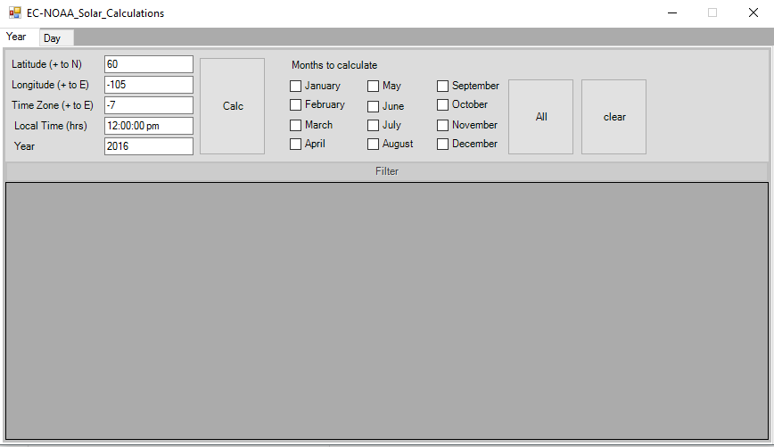

# EC-NOAA_Solar_Calculations
PowerShell 4.0 GUI for solarpanel calculation based on NOAA (http://www.esrl.noaa.gov/gmd/grad/solcalc/calcdetails.html)

I started this project because of a suggestion from a college. There are some bugs in Excel that falsify a few of the results.

I'm using this as an opportunity to do some math in PowerShell. As my whole family is using wood pellets, I will need some feedback of fellow GitHub users with connections to the solarpanel industry. If the first version is ready to be released, I will also try to get some feedback from local companies who install the panels.
There are probably a lot of columns to hide by default.

#### The initial view of the GUI:

#### View of the GUI with some calculated months and a few filtered columns:

#### View of the filter options for the datagrid:
